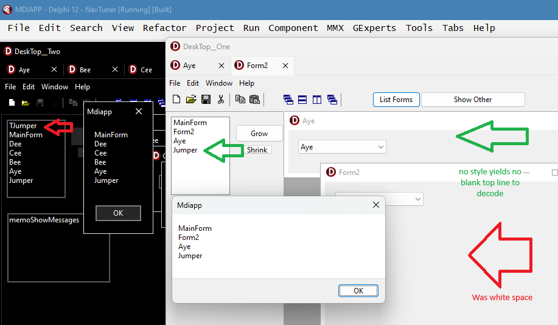
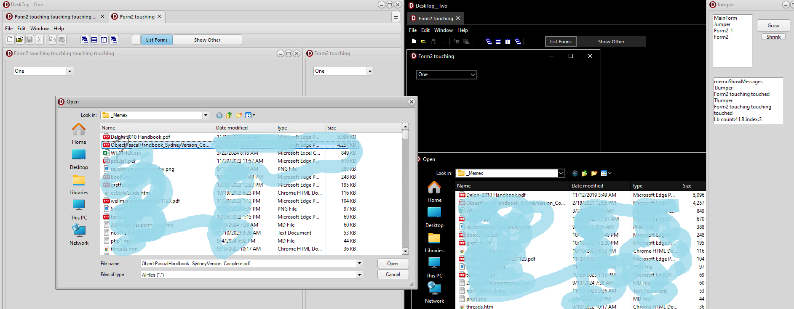

#MDI Demo




#Pat's MDI programming notes

Critical for the MDI child form to have cafree in on close for the visualManager to work tabs and child views.
//Global Forms names wreck the action

Even with the visual manager the windows can still get its slimey hands on a window parented on the chbeild.  the Sidebar parent is set to nil when MDICount < 2 on Activate and DeActivate Events.


Or how to reduce the need for global variables for both MDI and SDI use runtime
construction using names from the script in Inifile or a demo script embeded in a
Const Str. This allows the

Example app shows intregrating the form1 and form2 into the new improved MDI sample
First and second issue are the global variables Form1 and Form2. To turn them into MDIChildren We create the child forms with the Names inside a procedure and even using an var name inside a begin end block

The scope of the MDI children are nestled under the TWinControl the like a TGraphic Control ie the parent controls its drawing. FMX controls likely could been placed beside Tgraphic controls in class Heirarchy say TFMXControl vs TWinControl.


  The improved Mdiapp has the AboutBox created after the MainForm.

MDI likes the childform declared in the procedure doing the form2 and form4 readily
ran using the new MDI in D

##MDI Demo with a second MDI Demo running


```
begin
  LoaderVar := TwoHeadLoader;
  var command1:HWND := 1;
    DT1Handle := findwindow(DT1winclassname, nil);
//  inNewAppHnd := 42;//Application.Handle;
  OnTopH := GetForegroundWindow;

  if
    (LoaderVar( ShowHnd, DT1Handle, DT2Handle, OnTopH, Command1) > 0)
    and (command1 = 1)
    or (Command1 = 2)
  then

  Jumper := TSideBar.Create(Application);
  //Jumper.ListHwnd;

  Application.Initialize;
  //  this doesn't work on this job  the side bar shows up
  // on all the other Desktops when used.
  // It stlls gets an Icon ?
  //Application.MainFormOnTaskBar := True;
  Application.DefaultFont.Color := $DEC4B0;// Light steel blue
  Application.DefaultFont.name := 'Palatino Linotype';

  If command1 = 1 //   Create1stApp
    then begin
     // TStyleManager.TrySetStyle('Aqua Light Slate'); //different path in file dialog when no style applied!
      Application.CreateForm(TMainForm, MainForm);
      if  DT2Handle > 1 then
      MainForm.ComplementApp := DT2Handle;//CompHforDT1;
      Mainform.Role := 1;
      //MainForm.Caption := '   DT_One;
//      Application.Run;
//  ReportMemoryLeaksOnShutdown := True;

    end
  else
  if Command1 = 2 then

    begin
      TStyleManager.TrySetStyle('Windows10 Dark'); //was 'Sky'
      Application.DefaultFont.size := 14;//'Palatino Linotype'; //'Segoe UI';//
      //Application.DefaultFont.Color := $DEC4B0;// Light steel blue

      Application.CreateForm(TMainForm2, MainForm2);
      MainForm2.ComplementApp := DT1Handle;
      Mainform2.role := 2;
      //MainForm2.Caption := DT_Two + ' Gut ' + ParamStr(2);
//      Application.Run;
//      ReportMemoryLeaksOnShutdown := True;

    end;
```
I like to split the app into one app to on to focus on its subject matter and it's complement to capture everything else.
Here the split presents one app with Style and one naked.

When a style is used the snap dialog hide most of the restore button. Otherwise the Close button
on the form and tabs matches the behavior of modern browsers and the notepad and file explorer now have tabs.

Another thing about using style is the path the file dialog uses is changed


ModalR switch on bad if turning a


h12.475 Jumper Looked at MainForm
Dee
Cee
Bee
Aye
Jumper

h12.492 Aye Looked at MainForm
Cee
Jumper
Dee
Bee
Aye

h12.70638 Jumper on top
h12.460 Hnd 10948846 Comp 8329400
h12.530 TMessageForm
h12.531 Jumper Looked at MainForm
Jumper

h12.533 TMessageForm
h12.536 Jumper Looked at MainForm
Jumper

h6.29183 Shell_TrayWnd on top
h17.334 Hnd 3282860 Comp 6160912
h17.337 DeskTop__Two Looked at 0-MainForm
1-Jumper

h17.346 TMessageForm
h17.348 Dee Looked at 0-MainForm
1-Dee
2-Jumper
3-Cee
4-Bee
5-Aye

```
object LandingZone: TPanel
  Left = 0
  Top = 88
  Width = 207
  Height = 382
  Align = alLeft
  AutoSize = True
  BevelOuter = bvLowered
  Caption = 'LZ'
  Color = clSkyBlue
  ParentBackground = False
  TabOrder = 4
  StyleName = 'Windows'
end
```


The zip shows


[Shortyoutube]:https://www.youtube.com/watch?v=xEyKSzs5Yuw
     Stuff here

Short Vid [Shortyoutube]

Can't find improved MDI mentioned here. Blah. [MDI]:
```
MDI Reworked for HighDPI and VCL Styles support
Child forms can now have a new modern flat border (the new property is TStyleManager.ChangeChildFormSystemBorder)
MDI Child disabled border icons are not drawn
The Parent property works for nesting any form in any other form, with full border management
A significant MDI cleanup and improvements
The brand new TFormsBar control
The Auto Hiding of minimized child windows

1. The IFormVisualManager Interface
2. The VisualManager property of the TCustomForm class

3. The updated MDI Wizard
A new ShowInTaskbar property for TForm
A new CreateScaledNew constructor in the TCustomForm class
```
[MDI]:https://blogs.embarcadero.com/3-x-12-vcl-enhancements-in-delphi-12/#In_VCL_MDI_and_Forms_management


##Dave Nottage solution
```Delphi
procedure TBaseForm.ShowForm(const AShow: Boolean);
begin
  if AShow then
    ShowWindow(Handle, SW_SHOW)
  else
    ShowWindow(Handle, SW_HIDE);
end;
```

Simply removing the Exclude line let the program process the inherited but
```
//procedure TBaseForm.AfterConstruction;
//begin
////  Exclude(FFormState, fsVisible);
//  inherited;
//end;

```
Accessing the field FFormState allows loading the form sans __Visible__
```
//procedure TBaseForm.ChangeMDIVisiblity(const bShow: Boolean);
//begin
//  if bShow then
//  Include(FFormState,fsVisible)
//  else
//  Exclude(FFormState, fsVisible);
//
//
//end;
```
Switching the mainform VisualManager to a second TFormTabsBar to hold the second Desktop
```
object FormTabsBar2: TFormTabsBar
  Left = 0
  Top = 85
  Width = 404
  Height = 30
  ParentColor = False
  TabOptions.ShowFormIcon = True
  TabOptions.ShowFormSystemMenu = True
  TabOptions.ShowCloseButton = True
  TabOptions.ShowHintForTruncatedCaption = True
  TabMinWidth = 100
  TabMaxWidth = 250
  ShowTabsMenuButton = True
end
```
```Pascal .dpr
///
/// Tried using showmessage since debugging break points not working
///  this upset the catching the foreground window handle in Main code
//  ShowMessage(format('%s Hnd %d Found %d PassedIn %d App %d',[PassedDeskTop, Hnd, FoundInstanceHnd, PassedHnd, Application.Handle]));
//  ShowMessage(format('%s Hnd %d PassedIn %d App %d',[PassedDeskTop, Hnd, PassedHnd, Application.Handle]));

```
##Old MDI notes
<hr>

>But, assuming that NewValue is never negative, then I would use the Visible property which is a short-hand for Show/Hide:
>```
>Image1.Visible := NewValue>0;
>Image2.Visible := Image1.Visible;
>```
>This **declarative** approach typically results in clearer, more expressive code. Additionally it allows you to express concisely the fact that the visibility of these controls is tied together.
>DH comment on SO
<hr>

Was able to get the child menus to work using AutoMerge on the child form MainMenus and leaving automerge false on the main form menu works very good. Also determined that after construction hides visibility.

Windows 11 sometimes doesn't have the conventional BorderIcons on the main form. The child forms. Now have the exit Icon.
Secondly. to get the resize icon to resize and not snap the , you need to touch this above the snap dialog presented on Windows 11 to resize.

#Sercet mutex
procedure TMainForm2.CreateParams(var Params: TCreateParams);
begin
  inherited;
  Params.WinClassName := DT2winclassname;
   // Caption := DT2winclassname;
  //mutexDT2 := TMutex.Create(nil, False, DT2winclassname);//    '{82A1F532-3723-4F29-BBE3-3DAEE40894E7}');
end;

#possible precord
//  TProc
//  TmyProc = Procedure (Arg1: Integer; Arg2: string; H3: HWND;I4: Integer; B5: Boolean) ;
//
//  TAppInformation = record
//    Role: Integer;
//    Moniker: string;
//    Hnd: HWND;
//    starttick: Integer;
//    isComplement: Boolean;  //other wise back trce 2 to 1;
//    SetFields: TmyProc;
//    //SETTTFIELDS: TProc< Role:Integer,string,HWND,Integer,Boolean>;
//    update: TNotifyEvent;
//    procedure Onupdate(Sender: TObject);
//    procedure Setmyfields( I1: Integer; S2: string; H3: HWND; I4: Integer; B5: Boolean);
//  end;
{ TAppInformation }

//procedure TAppInformation.Onupdate(Sender: TObject);
//begin
//  If Assigned(update) then Setmyfields(Role,moniker,Hnd,starttick,isComplement);
//end;
//
//procedure TAppInformation.SetMyFields(I1: Integer; S2: string; H3: HWND; I4: Integer; B5: Boolean);
//begin
////  Role := Arg1;
////  Moniker := Arg2;
////  Hnd := H3;
////  starttick := GetTickCount64;
////  isComplement := B5; // other wise back trce 2 to 1;
//  if role = 1 then
//  // component needs checked
//    iswindow(Hnd) //S
//end;
# Rid the mutexs

//procedure TMainForm2.FormClose(Sender: TObject; var Action: TCloseAction);
//begin
//  mutexDT2.Free;
//end;


//procedure TMainForm2.FormDestroy(Sender: TObject);
//begin
//  mutexDT2.Free;
//  inherited;
//end;

```
object Panel1: TPanel
  Left = 736
  Top = 176
  Width = 100
  Height = 100
  Caption = 'Panel1'
  TabOrder = 3
  object Label2: TLabel
    Left = 66
    Top = 0
    Width = 34
    Height = 15
    Caption = 'Label1'
  end
  object Label3: TLabel
    Left = 66
    Top = 8
    Width = 34
    Height = 15
    Caption = 'Label1'
  end
  object btnShowDT1: TButton
    Left = -49
    Top = 68
    Width = 141
    Height = 22
    Caption = 'DT 1'
    TabOrder = 0
    OnClick = btnShowDT1Click
  end
  object btnShow_Other_App: TButton
    Left = -113
    Top = 56
    Width = 165
    Height = 22
    Caption = 'Open Desktop Two'
    TabOrder = 1
    OnClick = btnShow_Other_AppClick
  end
  object tbListForms: TButton
    Left = 25
    Top = 0
    Width = 75
    Height = 22
    Hint = 'List all forms using Screendotforms'
    Caption = 'List Forms'
    TabOrder = 2
    OnClick = tbListFormsClick
  end
end
``` //cut 2024.12.16
